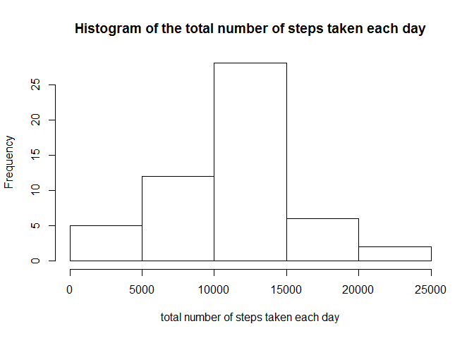
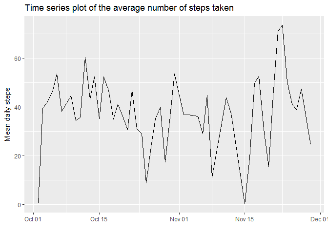
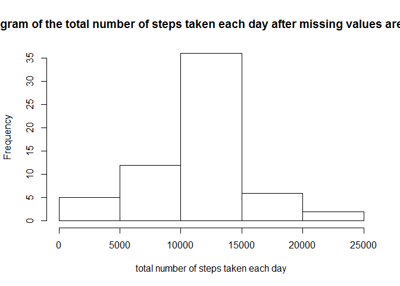
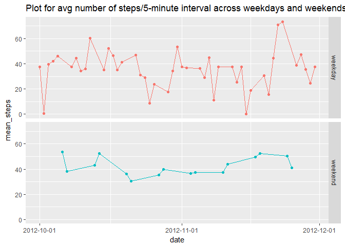

### This document is created as part of the assigment requirements of course reproducible-research- Week 2 Peer-graded Assignment: Course Project 1 .

The
[dataset](https://d396qusza40orc.cloudfront.net/repdata%2Fdata%2Factivity.zip)
being used for this assigment is of size 56 kb, and has below listed
variables

-   steps: Number of steps taking in a 5-minute interval (missing values
    are coded as NA)
-   date: The date on which the measurement was taken in YYYY-MM-DD
    format
-   interval: Identifier for the 5-minute interval in which measurement
    was taken

The dataset is stored in a comma-separated-value (CSV) file and there
are a total of 17,568 observations in this dataset.

### Load the required libraries

    library(ggplot2)
    library("lubridate")

    ## 
    ## Attaching package: 'lubridate'

    ## The following object is masked from 'package:base':
    ## 
    ##     date

    library(scales)
    library("Hmisc")

    ## Loading required package: lattice

    ## Loading required package: survival

    ## Loading required package: Formula

    ## 
    ## Attaching package: 'Hmisc'

    ## The following objects are masked from 'package:base':
    ## 
    ##     format.pval, round.POSIXt, trunc.POSIXt, units

### Data Processing (1.Code for reading in the dataset and/or processing the data)

Lets download and unzip the dataset and store into activityData

    download.file("https://d396qusza40orc.cloudfront.net/repdata%2Fdata%2Factivity.zip", destfile="Factivity.zip")
    unzip("Factivity.zip")
    activityData <- read.csv("activity.csv", sep = ",")

Now, we should get an overview of the available data

    class(activityData)

    ## [1] "data.frame"

    dim(activityData)

    ## [1] 17568     3

    str(activityData)

    ## 'data.frame':    17568 obs. of  3 variables:
    ##  $ steps   : int  NA NA NA NA NA NA NA NA NA NA ...
    ##  $ date    : Factor w/ 61 levels "2012-10-01","2012-10-02",..: 1 1 1 1 1 1 1 1 1 1 ...
    ##  $ interval: int  0 5 10 15 20 25 30 35 40 45 ...

    head(activityData)

    ##   steps       date interval
    ## 1    NA 2012-10-01        0
    ## 2    NA 2012-10-01        5
    ## 3    NA 2012-10-01       10
    ## 4    NA 2012-10-01       15
    ## 5    NA 2012-10-01       20
    ## 6    NA 2012-10-01       25

    tail(activityData)

    ##       steps       date interval
    ## 17563    NA 2012-11-30     2330
    ## 17564    NA 2012-11-30     2335
    ## 17565    NA 2012-11-30     2340
    ## 17566    NA 2012-11-30     2345
    ## 17567    NA 2012-11-30     2350
    ## 17568    NA 2012-11-30     2355

Lets check the data type for date field

    class(activityData$date)

    ## [1] "factor"

We will now convert factor date field to data class date

    activityData$date <- as.Date(activityData$date, format = "%Y-%m-%d")
    class(activityData$date)

    ## [1] "Date"

We can now remove the NA values,

    activityData <- na.omit(activityData)

### 2.Plot Histogram of the total number of steps taken each day

Now to plot Histogram of the total number of steps taken each day, we
will aggregate steps by date, and store the aggreated data in aggdata

    aggdata <- setNames(aggregate(activityData[,1], by=list(activityData$date), FUN=sum, na.rm=TRUE), c("Date", "Sum_steps"))
    head(aggdata)

    ##         Date Sum_steps
    ## 1 2012-10-02       126
    ## 2 2012-10-03     11352
    ## 3 2012-10-04     12116
    ## 4 2012-10-05     13294
    ## 5 2012-10-06     15420
    ## 6 2012-10-07     11015

    tail(aggdata)

    ##          Date Sum_steps
    ## 48 2012-11-24     14478
    ## 49 2012-11-25     11834
    ## 50 2012-11-26     11162
    ## 51 2012-11-27     13646
    ## 52 2012-11-28     10183
    ## 53 2012-11-29      7047

    hist(aggdata$Sum_steps, main = "Histogram of the total number of steps taken each day", xlab = "total number of steps taken each day")

### 3.Mean and median number of steps taken each day

Mean and Median of total number of steps taken in each day are:

    mean(aggdata$Sum_steps)

    ## [1] 10766.19

    median(aggdata$Sum_steps)

    ## [1] 10765

### 4.Time series plot of the average number of steps taken

Time series plot of the average number of steps taken

    meandata <- setNames(aggregate(activityData[,1], by=list(activityData$date), FUN=mean, na.rm=TRUE), c("date", "mean_steps"))
    ggplot(meandata, aes(date, mean_steps)) + geom_line() + xlab("") + ylab("Mean daily steps") + ggtitle("Time series plot of the average number of steps taken")

### 5. The 5-minute interval that, on average, contains the maximum number of steps

Now to calculate "The 5-minute interval that, on average, contains the
maximum number of steps" we fill aggregate mean of activityData by 5
minute interval

    meandataall<- setNames(aggregate(activityData[,1], by=list(activityData$interval), FUN=mean, na.rm=TRUE), c("interval","mean_steps"))
    meandataall[which.max(meandataall[,2]),]

    ##     interval mean_steps
    ## 104      835   206.1698

**From the above output, we can see that interval 835 is having the
maximum number os steps.**

### 6.Code to describe and show a strategy for imputing missing data

To answer rest of questions, lets get the initial dataframe with NA
values,

    activityData <- read.csv("activity.csv", sep = ",")
    activityData$date <- as.Date(activityData$date, format = "%Y-%m-%d")

Now, we will use Hmisc package and impute to impute missing data with
mean value,

    head(activityData)

    ##   steps       date interval
    ## 1    NA 2012-10-01        0
    ## 2    NA 2012-10-01        5
    ## 3    NA 2012-10-01       10
    ## 4    NA 2012-10-01       15
    ## 5    NA 2012-10-01       20
    ## 6    NA 2012-10-01       25

    activityData$steps <- with(activityData, impute(steps, mean))
    head(activityData)

    ##     steps       date interval
    ## 1 37.3826 2012-10-01        0
    ## 2 37.3826 2012-10-01        5
    ## 3 37.3826 2012-10-01       10
    ## 4 37.3826 2012-10-01       15
    ## 5 37.3826 2012-10-01       20
    ## 6 37.3826 2012-10-01       25

### 7. Histogram of the total number of steps taken each day after missing values are imputed

Now, lets plot Histogram of the total number of steps taken each day
after missing values are imputed

    aggdata <- setNames(aggregate(activityData[,1], by=list(activityData$date), FUN=sum, na.rm=TRUE), c("Date", "Sum_steps"))
    head(aggdata)

    ##         Date Sum_steps
    ## 1 2012-10-01  10766.19
    ## 2 2012-10-02    126.00
    ## 3 2012-10-03  11352.00
    ## 4 2012-10-04  12116.00
    ## 5 2012-10-05  13294.00
    ## 6 2012-10-06  15420.00

    tail(aggdata)

    ##          Date Sum_steps
    ## 56 2012-11-25  11834.00
    ## 57 2012-11-26  11162.00
    ## 58 2012-11-27  13646.00
    ## 59 2012-11-28  10183.00
    ## 60 2012-11-29   7047.00
    ## 61 2012-11-30  10766.19

    hist(aggdata$Sum_steps, main = "Histogram of the total number of steps taken each day after missing values are imputed", xlab = "total number of steps taken each day")

### 8.Panel plot comparing the average number of steps taken per 5-minute interval across weekdays and weekends

Finally, we will Panel plot comparing the average number of steps taken
per 5-minute interval across weekdays and weekends

    meandata <- setNames(aggregate(activityData[,1], by=list(activityData$date), FUN=mean, na.rm=TRUE), c("date", "mean_steps"))
    meandata$day <- wday(meandata$date, label = TRUE)
    meandata$week <- ifelse(weekdays(meandata$date) %in% c("Saturday", "Sunday"), "weekend", "weekday")
    meandata$week <- factor(meandata$week,labels=c("weekday","weekend"))
    class(meandata$week)

    ## [1] "factor"

    ggplot(meandata, aes(x=date, y=mean_steps, colour=week)) + 
      geom_path() + 
      geom_point() + scale_x_date(breaks=date_breaks("1 month")) +
      facet_grid(week ~.) +
      theme(legend.position="none") + ggtitle("Plot for avg number of steps/5-minute interval across weekdays and weekends")

